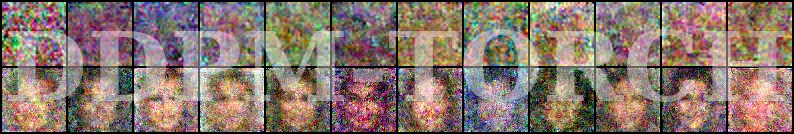
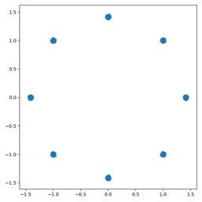
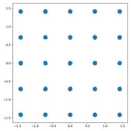
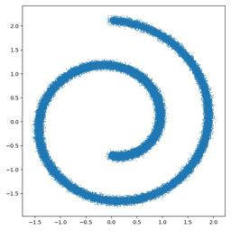
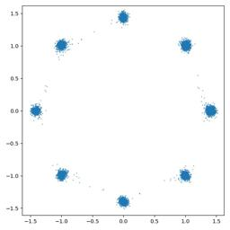

<p align="center"></p>

---

# PyTorch Implementation of Denoising Diffusion Probabilistic Models [[paper]](https://arxiv.org/abs/2006.11239) [[official repo]](https://github.com/hojonathanho/diffusion)


## Features

- [x] Original DDPM[^1] training & sampling
- [x] DDIM[^2] sampler
- [x] Standard evaluation metrics
	- [x] Fréchet Inception Distance[^3] (FID)
	- [x] Precision & Recall[^4]
- [x] Distributed Data Parallel[^5] (DDP) multi-GPU training


## Requirements

- torch>=1.12.0
- torchvision>=1.13.0
- scipy>=1.7.3


## Code usage

<p align="center">
	<table width="100%">
		<tr>
			<th width="25%" align="center">Toy data</th>
			<th width="75%" colspan="3" align="center">Real-world data&emsp;</th>
		</tr><tr>
			<th align="center">Training</th>
			<th align="center">Training</th>
			<th align="center">Generation</th>
			<th align="center">Evaluation</th>
		</tr>
			<td><details>
			<summary>Expand</summary>
			<pre><code>
usage: train_toy.py [-h] [--dataset {gaussian8,gaussian25,swissroll}]      
                    [--size SIZE] [--root ROOT] [--epochs EPOCHS] [--lr LR]
                    [--beta1 BETA1] [--beta2 BETA2] [--lr-warmup LR_WARMUP]
                    [--batch-size BATCH_SIZE] [--timesteps TIMESTEPS]      
                    [--beta-schedule {quad,linear,warmup10,warmup50,jsd}]  
                    [--beta-start BETA_START] [--beta-end BETA_END]        
                    [--model-mean-type {mean,x_0,eps}]                     
                    [--model-var-type {learned,fixed-small,fixed-large}]   
                    [--loss-type {kl,mse}] [--image-dir IMAGE_DIR]         
                    [--chkpt-dir CHKPT_DIR] [--chkpt-intv CHKPT_INTV]      
                    [--eval-intv EVAL_INTV] [--seed SEED] [--resume]       
                    [--device DEVICE] [--mid-features MID_FEATURES]        
                    [--num-temporal-layers NUM_TEMPORAL_LAYERS]            
optional arguments:                                                        
  -h, --help            show this help message and exit                    
  --dataset {gaussian8,gaussian25,swissroll}                               
  --size SIZE                                                              
  --root ROOT           root directory of datasets                         
  --epochs EPOCHS       total number of training epochs                    
  --lr LR               learning rate                                      
  --beta1 BETA1         beta_1 in Adam                                     
  --beta2 BETA2         beta_2 in Adam                                     
  --lr-warmup LR_WARMUP                                                    
                        number of warming-up epochs                        
  --batch-size BATCH_SIZE                                                  
  --timesteps TIMESTEPS                                                    
                        number of diffusion steps                          
  --beta-schedule {quad,linear,warmup10,warmup50,jsd}                      
  --beta-start BETA_START                                                  
  --beta-end BETA_END                                                      
  --model-mean-type {mean,x_0,eps}
  --model-var-type {learned,fixed-small,fixed-large}
  --loss-type {kl,mse}
  --image-dir IMAGE_DIR
  --chkpt-dir CHKPT_DIR
  --chkpt-intv CHKPT_INTV
                        frequency of saving a checkpoint
  --eval-intv EVAL_INTV
  --seed SEED           random seed
  --resume              to resume training from a checkpoint
  --device DEVICE
  --mid-features MID_FEATURES
  --num-temporal-layers NUM_TEMPORAL_LAYERS
                </code></pre>
            </details>
			</td><td>
			<details>
				<summary>Expand</summary>
				<pre><code>
usage: train.py [-h] [--dataset {mnist,cifar10,celeba,celebahq}] [--root ROOT]
                [--epochs EPOCHS] [--lr LR] [--beta1 BETA1] [--beta2 BETA2]   
                [--batch-size BATCH_SIZE] [--num-accum NUM_ACCUM]
                [--block-size BLOCK_SIZE] [--timesteps TIMESTEPS]
                [--beta-schedule {quad,linear,warmup10,warmup50,jsd}]
                [--beta-start BETA_START] [--beta-end BETA_END]
                [--model-mean-type {mean,x_0,eps}]
                [--model-var-type {learned,fixed-small,fixed-large}]
                [--loss-type {kl,mse}] [--num-workers NUM_WORKERS]
                [--train-device TRAIN_DEVICE] [--eval-device EVAL_DEVICE]
                [--image-dir IMAGE_DIR] [--image-intv IMAGE_INTV]
                [--num-save-images NUM_SAVE_IMAGES] [--config-dir CONFIG_DIR]
                [--chkpt-dir CHKPT_DIR] [--chkpt-name CHKPT_NAME]
                [--chkpt-intv CHKPT_INTV] [--seed SEED] [--resume]
                [--chkpt-path CHKPT_PATH] [--eval] [--use-ema]
                [--ema-decay EMA_DECAY] [--distributed] [--rigid-launch]
                [--num-gpus NUM_GPUS] [--dry-run]
optional arguments:
  -h, --help            show this help message and exit
  --dataset {mnist,cifar10,celeba,celebahq}
  --root ROOT           root directory of datasets
  --epochs EPOCHS       total number of training epochs
  --lr LR               learning rate
  --beta1 BETA1         beta_1 in Adam
  --beta2 BETA2         beta_2 in Adam
  --batch-size BATCH_SIZE
  --num-accum NUM_ACCUM
                        number of mini-batches before an update
  --block-size BLOCK_SIZE
                        block size used for pixel shuffle
  --timesteps TIMESTEPS
                        number of diffusion steps
  --beta-schedule {quad,linear,warmup10,warmup50,jsd}
  --beta-start BETA_START
  --beta-end BETA_END
  --model-mean-type {mean,x_0,eps}
  --model-var-type {learned,fixed-small,fixed-large}
  --loss-type {kl,mse}
  --chkpt-path CHKPT_PATH
                        checkpoint path used to resume training
  --eval                whether to evaluate fid during training
  --use-ema             whether to use exponential moving average
  --ema-decay EMA_DECAY
                        decay factor of ema
  --distributed         whether to use distributed training
  --rigid-launch        whether to use torch multiprocessing spawn
  --num-gpus NUM_GPUS   number of gpus for distributed training
  --dry-run             test-run till the first model update completes
            	</code></pre>
            </details>
			</td><td>
			<details>
			<summary>Expand</summary>
			<pre><code>
usage: generate.py [-h] [--dataset {mnist,cifar10,celeba,celebahq}]
                   [--batch-size BATCH_SIZE] [--total-size TOTAL_SIZE]
                   [--config-dir CONFIG_DIR] [--chkpt-dir CHKPT_DIR]
                   [--chkpt-path CHKPT_PATH] [--save-dir SAVE_DIR]
                   [--device DEVICE] [--use-ema] [--use-ddim] [--eta ETA]
                   [--skip-schedule SKIP_SCHEDULE] [--subseq-size SUBSEQ_SIZE]
                   [--suffix SUFFIX] [--max-workers MAX_WORKERS]
                   [--num-gpus NUM_GPUS]
optional arguments:
  -h, --help            show this help message and exit
  --dataset {mnist,cifar10,celeba,celebahq}
  --batch-size BATCH_SIZE
  --total-size TOTAL_SIZE
  --config-dir CONFIG_DIR
  --chkpt-dir CHKPT_DIR
  --chkpt-path CHKPT_PATH
  --save-dir SAVE_DIR
  --device DEVICE
  --use-ema
  --use-ddim
  --eta ETA
  --skip-schedule SKIP_SCHEDULE
  --subseq-size SUBSEQ_SIZE
  --suffix SUFFIX
  --max-workers MAX_WORKERS
  --num-gpus NUM_GPUS
			</pre></code>
			</details>
			</td><td>
			<details>
			<summary>Expand</summary>
			<pre><code>
usage: eval.py [-h] [--root ROOT] [--dataset {mnist,cifar10,celeba,celebahq}]
               [--model-device MODEL_DEVICE] [--eval-device EVAL_DEVICE]
               [--eval-batch-size EVAL_BATCH_SIZE]
               [--eval-total-size EVAL_TOTAL_SIZE] [--num-workers NUM_WORKERS]
               [--nhood-size NHOOD_SIZE] [--row-batch-size ROW_BATCH_SIZE]
               [--col-batch-size COL_BATCH_SIZE] [--device DEVICE]
               [--eval-dir EVAL_DIR] [--precomputed-dir PRECOMPUTED_DIR]
               [--metrics METRICS [METRICS ...]] [--seed SEED]
               [--folder-name FOLDER_NAME]
optional arguments:
  -h, --help            show this help message and exit
  --root ROOT
  --dataset {mnist,cifar10,celeba,celebahq}
  --model-device MODEL_DEVICE
  --eval-device EVAL_DEVICE
  --eval-batch-size EVAL_BATCH_SIZE
  --eval-total-size EVAL_TOTAL_SIZE
  --num-workers NUM_WORKERS
  --nhood-size NHOOD_SIZE
  --row-batch-size ROW_BATCH_SIZE
  --col-batch-size COL_BATCH_SIZE
  --device DEVICE
  --eval-dir EVAL_DIR
  --precomputed-dir PRECOMPUTED_DIR
  --metrics METRICS [METRICS ...]
  --seed SEED
  --folder-name FOLDER_NAME
			</pre></code>
			</details>
			</td>
		</tr>
	</table>
</p>

**Examples**

- Train a 25-Gaussian toy model with single GPU (device id: 0) for a total of 100 epochs

    ```shell
    python train_toy.py --dataset gaussian25 --device cuda:0 --epochs 100
    ```

- Train CIFAR-10 model with single GPU (device id: 0) for a total of 50 epochs
    ```shell
    python train.py --dataset cifar10 --train-device cuda:0 --epochs 50
    ```

(*You can always use `dry-run` for testing/tuning purpose.*)

- Train a CelebA model with an effective batch size of 64 x 2 x 4 = 128 on a four-card machine (single node) using shared file-system initialization
    ```shell
    python train.py --dataset celeba --num-accum 2 --num-gpus 4 --distributed --rigid-launch
    ```
    - `num-accum 2`: accumulate gradients for 2 mini-batches
    - `num-gpus`: number of GPU(s) to use for training, i.e. `WORLD_SIZE` of the process group
    - `distributed`: enable multi-gpu DDP training
    - `rigid-run`: use shared-file system initialization and `torch.multiprocessing`
    
- (**Recommended**) Train a CelebA model with an effective batch-size of 64 x 1 x 2 = 128 using only two GPUs with `torchrun` Elastic Launch[^6] (TCP initialization)
    ```shell
    export CUDA_VISIBLE_DEVICES=0,1&&torchrun --standalone --nproc_per_node 2 --rdzv_backend c10d train.py --dataset celeba --distributed
    ```

- Generate 50,000 samples (128 per mini-batch) of the checkpoint located at `./chkpts/cifar10/cifar10_2040.pt` in parallel using 4 GPUs and DDIM sampler. The results are stored in `./images/eval/cifar10/cifar10_2040_ddim`
	```shell
	python generate.py --dataset cifar10 --chkpt-path ./chkpts/cifar10/cifar10_2040.pt --use-ddim --skip-schedule quadratic --subseq-size 100 --suffix _ddim --num-gpus 4
	```
    - `use-ddim`: use DDIM
    - `skip-schedule quadratic`: use the quadratic schedule
    - `subseq-size`: length of sub-sequence, i.e. DDIM timesteps
    - `suffix`: suffix string to the dataset name in the folder name
    - `num-gpus`: number of GPU(s) to use for generation

- Evaluate FID, Precision/Recall of generated samples in `./images/eval/cifar10_2040`
	```shell
	python eval.py --dataset cifar10 --sample-folder ./images/eval/cifar10/cifar10_2040
	```

## Experiment results

### Toy data

<p align="center">
	<table width="100%">
		<tr>
			<th width="10%"><b>Dataset</b></th>
			<th width="30%" align="center">8&nbsp;Gaussian</th>
			<th width="30%" align="center">25&nbsp;Gaussian</th>
			<th width="30%" align="center">Swiss&nbsp;Roll</th>
		</tr><tr>
			<td><b>True</b></td>
			<td><a href="./assets/toy/gaussian8_true.jpg">
			
			</a></td>
			<td><a href="./assets/toy/gaussian25_true.jpg">
			</a></td>
			<td><a href="./assets/toy/swissroll_true.jpg">
			</a></td>
		</tr><tr>
			<td><b>Generated</b></td>
			<td><a href="./assets/toy/gaussian8_gen.jpg">
			</a></td>
			<td><a href="./assets/toy/gaussian25_gen.jpg">
			</a></td>
			<td><a href="./assets/toy/swissroll_gen.jpg">
			</a></td>
		</tr>
	</table>
</p>

<details>
	<summary>Training process (animated)</summary>
    <p>
        <table width="100%">
            <tr>
                <th width="10%"><b>Dataset</b></th>
                <th width="30%" align="center">8&nbsp;Gaussian</th>
                <th width="30%" align="center">25&nbsp;Gaussian</th>
                <th width="30%" align="center">Swiss&nbsp;Roll</th>
            </tr><tr>
                <td><b>Generated</b></td>
                <td><a href="./assets/toy/gaussian8_train.webp">
				</a></td>
                <td><a href="./assets/toy/gaussian25_train.webp">
				</a></td>
                <td><a href="./assets/toy/swissroll_train.webp">
				</a></td>
            </tr>
        </table>
    </p>
</details>

### Real-world data

*Table of evaluated metrics*

<p align="center">
    <table width="100%">
        <tr>
            <th align="center">Dataset</th>
            <th align="center">FID (↓)</th>
            <th align="center">Precision (↑)</th>
            <th align="center">Recall (↑)</th>
            <th align="center">Training steps</th>
            <th align="center">Training loss</th>
            <th align="center">Checkpoint</th>
        </tr><tr>
            <td align="center">CIFAR-10</td>
            <td align="center">9.162</td>
            <td align="center">0.691</td>
            <td align="center">0.473</td>
            <td align="center">46.8k</td>
            <td align="center">0.0295</td>
			<td align="center">-</td>
        </tr>
        <tr>
            <td align="center">|__</td>
            <td align="center">5.778</td>
            <td align="center">0.697</td>
            <td align="center">0.516</td>
            <td align="center">93.6k</td>
            <td align="center">0.0293</td>
            <td align="center">-</td>
        </tr><tr>
            <td align="center">|__</td>
            <td align="center">4.083</td>
            <td align="center">0.705</td>
            <td align="center">0.539</td>
            <td align="center">187.2k</td>
            <td align="center">0.0291</td>
            <td align="center">-</td>
        </tr><tr>
            <td align="center">|__</td>
            <td align="center">3.31</td>
            <td align="center">0.722</td>
            <td align="center"><b>0.551</b></td>
            <td align="center">421.2k</td>
            <td align="center">0.0284</td>
            <td align="center">-</td>
        </tr>
        <tr>
            <td align="center">|__</td>
            <td align="center"><b>3.188</b></td>
            <td align="center"><b>0.739</b></td>
            <td align="center">0.544</td>
            <td align="center">795.6k</td>
            <td align="center"><b>0.0277</b></td>
            <td align="center"><a href="https://github.com/tqch/ddpm-torch/releases/download/checkpoints/cifar10_2040.pt">[Link]</a></td>
        </tr><tr>
            <td align="center">CelebA</td>
            <td align="center">4.806</td>
            <td align="center"><b>0.772</b></td>
            <td align="center">0.484</td>
            <td align="center">189.8k</td>
            <td align="center">0.0155</td>
			<td align="center">-</td>
        </tr>
        <tr>
            <td align="center">|__</td>
            <td align="center">3.797</td>
            <td align="center">0.764</td>
            <td align="center">0.511</td>
            <td align="center">379.7k</td>
            <td align="center">0.0152</td>
			<td align="center">-</td>
        </tr>
        <tr>
            <td align="center">|__</td>
            <td align="center"><b>2.995</b></td>
            <td align="center">0.760</td>
            <td align="center"><b>0.540</b></td>
            <td align="center">949.2k</td>
            <td align="center"><b>0.0148</b></td>
			<td align="center"><a href="https://github.com/tqch/ddpm-torch/releases/download/checkpoints/celeba_600.pt">[Link]</a></td>
        </tr><tr>
            <td align="center">CelebA-HQ</td>
            <td align="center">19.742</td>
            <td align="center">0.683</td>
            <td align="center">0.256</td>
            <td align="center">56.2k</td>
            <td align="center">0.0105</td>
			<td align="center">-</td>
        </tr>
        <tr>
            <td align="center">|__</td>
            <td align="center">11.971</td>
            <td align="center">0.705</td>
            <td align="center">0.364</td>
            <td align="center">224.6k</td>
            <td align="center"><b>0.0097</b></td>
			<td align="center">-</td>
        </tr>
        <tr>
            <td align="center">|__</td>
            <td align="center"><b>8.851</b></td>
            <td align="center">0.768</td>
            <td align="center"><b>0.376</b></td>
            <td align="center">393.1k</td>
            <td align="center">0.0098</td>
            <td align="center">-</td>
        </tr>
        <tr>
            <td align="center">|__</td>
            <td align="center">8.91</td>
            <td align="center"><b>0.800</b></td>
            <td align="center">0.357</td>
            <td align="center">561.6k</td>
            <td align="center">0.0097</td>
            <td align="center"><a href="https://github.com/tqch/ddpm-torch/releases/download/celeba_hq/celebahq_1200.pt">[Link]</a></td>
        </tr>
    </table>
</p>

<p align="center">
	<table width="100%">
            <tr>
                <th width="10%">Dataset</th>
                <th width="30%" align="center">CIFAR-10</td>
                <th width="30%" align="center">CelebA</td>
                <th width="30%" align="center">CelebA-HQ</td>
            </tr><tr>
                <td><b>Generated images</b></td>
                <td><a href="./assets/cifar10_gen.png">
                
                </a></td>
                <td><a href="./assets/celeba_gen.png" >
                
                </a></td>
                <td><a href="./assets/celebahq_gen.png" >
                
                </a></td>
            </tr>
    </table>
</p>

<details>
	<summary>Denoising process (animated)</summary>
    <p align="center">
        <table width="100%">
        	<tr>
                <th width="10%">Dataset</th>
                <th width="30%" align="center">CIFAR-10</td>
                <th width="30%" align="center">CelebA</td>
                <th width="30%" align="center">CelebA-HQ</td>
            </tr><tr>
                <td><b>Generated images</b></td>
                <td>
                <a href="./assets/cifar10_denoise.webp">
                
                </a></td>
                <td><a href="./assets/celeba_denoise.mp4">
                
                </a></td>
                <td>
                <a href="./assets/celebahq_denoise.mp4">
                
                </a></td>
			</tr>
        </table>
    </p>
</details>

## Related repositories
- Simple Web App empowered by Streamlit: [[tqch/diffusion-webapp]](https://github.com/tqch/diffusion-webapp)
- Classifier-Free Guidance: [[tqch/v-diffusion-torch]](https://github.com/tqch/v-diffusion-torch)


## References

[^1]: Ho, Jonathan, Ajay Jain, and Pieter Abbeel. "Denoising diffusion probabilistic models." Advances in Neural Information Processing Systems 33 (2020): 6840-6851.
[^2]: Song, Jiaming, Chenlin Meng, and Stefano Ermon. "Denoising Diffusion Implicit Models." International Conference on Learning Representations. 2020.
[^3]: Heusel, Martin, et al. "Gans trained by a two time-scale update rule converge to a local nash equilibrium." Advances in neural information processing systems 30 (2017).
[^4]: Kynkäänniemi, Tuomas, et al. "Improved precision and recall metric for assessing generative models." Advances in Neural Information Processing Systems 32 (2019).
[^5]: DistributedDataParallel - PyTorch 1.12 Documentation, https://pytorch.org/docs/stable/generated/torch.nn.parallel.DistributedDataParallel.html.
[^6]: Torchrun (Elastic Launch) - PyTorch 1.12 Documentation*, https://pytorch.org/docs/stable/elastic/run.html. 

