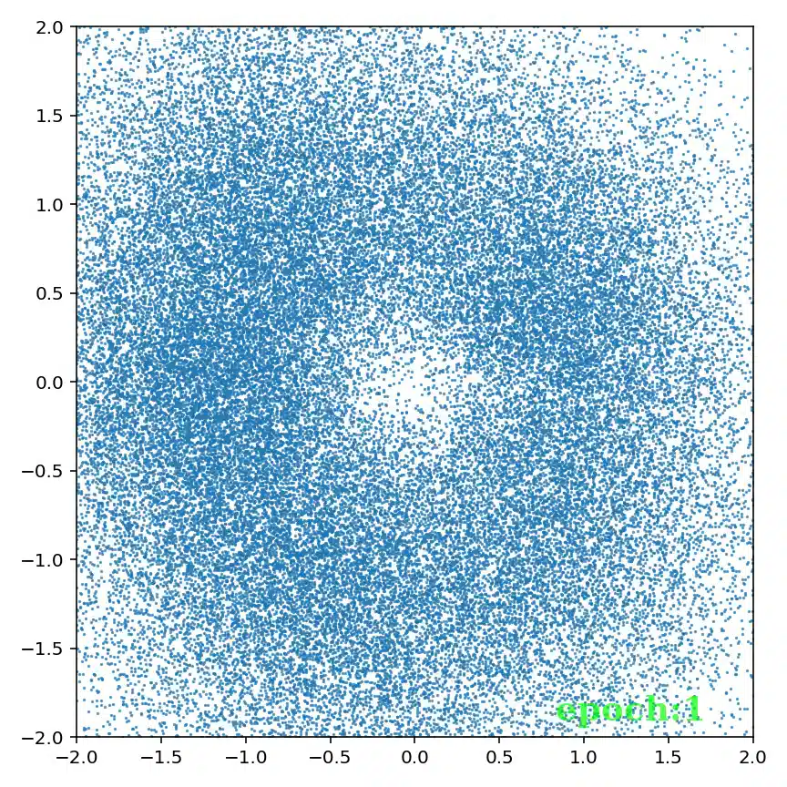
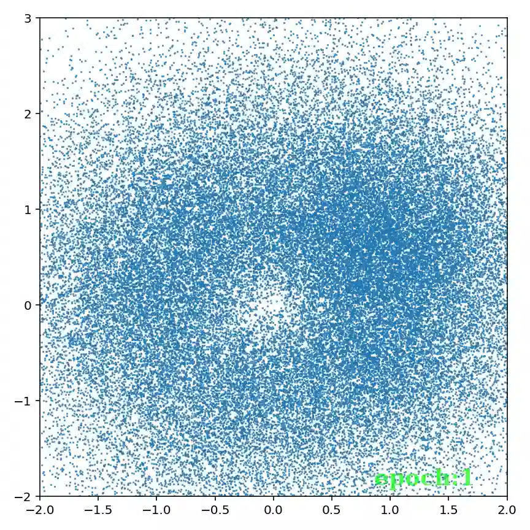

<p align="center">

</p>

---

# PyTorch Implementation of Denoising Diffusion Probabilistic Models [[paper]](https://arxiv.org/abs/2006.11239) [[official repo]](https://github.com/hojonathanho/diffusion)

## Code usage

### Toy data

<details>
<summary>Expand</summary>
<pre><code>
usage: train_toy.py [-h] [--dataset {gaussian8,gaussian25,swissroll}]
                    [--size SIZE] [--root ROOT] [--epochs EPOCHS] [--lr LR]
                    [--beta1 BETA1] [--beta2 BETA2] [--lr-warmup LR_WARMUP]
                    [--batch-size BATCH_SIZE] [--timesteps TIMESTEPS]
                    [--beta-schedule {quad,linear,warmup10,warmup50,jsd}]
                    [--beta-start BETA_START] [--beta-end BETA_END]
                    [--model-mean-type {mean,x_0,eps}]
                    [--model-var-type {learned,fixed-small,fixed-large}]
                    [--loss-type {kl,mse}] [--image-dir IMAGE_DIR]
                    [--chkpt-dir CHKPT_DIR] [--chkpt-intv CHKPT_INTV]
                    [--eval-intv EVAL_INTV] [--seed SEED] [--resume]
                    [--device DEVICE] [--mid-features MID_FEATURES]
                    [--num-temporal-layers NUM_TEMPORAL_LAYERS]
optional arguments:
  -h, --help            show this help message and exit
  --dataset {gaussian8,gaussian25,swissroll}
  --size SIZE
  --root ROOT           root directory of datasets
  --epochs EPOCHS       total number of training epochs
  --lr LR               learning rate
  --beta1 BETA1         beta_1 in Adam
  --beta2 BETA2         beta_2 in Adam
  --lr-warmup LR_WARMUP
                        number of warming-up epochs
  --batch-size BATCH_SIZE
  --timesteps TIMESTEPS
                        number of diffusion steps
  --beta-schedule {quad,linear,warmup10,warmup50,jsd}
  --beta-start BETA_START
  --beta-end BETA_END
  --model-mean-type {mean,x_0,eps}
  --model-var-type {learned,fixed-small,fixed-large}
  --loss-type {kl,mse}
  --image-dir IMAGE_DIR
  --chkpt-dir CHKPT_DIR
  --chkpt-intv CHKPT_INTV
                        frequency of saving a checkpoint
  --eval-intv EVAL_INTV
  --seed SEED           random seed
  --resume              to resume from a checkpoint
  --device DEVICE
  --mid-features MID_FEATURES
  --num-temporal-layers NUM_TEMPORAL_LAYERS
</code></pre>
</details>

### Real-world data

<details><summary>Expand</summary>
<pre><code>
usage: train.py [-h] [--dataset {mnist,cifar10,celeba}] [--root ROOT]
                [--epochs EPOCHS] [--lr LR] [--beta1 BETA1] [--beta2 BETA2]
                [--batch-size BATCH_SIZE] [--timesteps TIMESTEPS]
                [--beta-schedule {quad,linear,warmup10,warmup50,jsd}]
                [--beta-start BETA_START] [--beta-end BETA_END]
                [--model-mean-type {mean,x_0,eps}]
                [--model-var-type {learned,fixed-small,fixed-large}]
                [--loss-type {kl,mse}] [--num-workers NUM_WORKERS]
                [--train-device TRAIN_DEVICE] [--eval-device EVAL_DEVICE]
                [--image-dir IMAGE_DIR] [--num-save-images NUM_SAVE_IMAGES]
                [--config-dir CONFIG_DIR] [--chkpt-dir CHKPT_DIR]
                [--chkpt-intv CHKPT_INTV] [--seed SEED] [--resume] [--eval]
                [--use-ema] [--ema-decay EMA_DECAY] [--distributed]
optional arguments:
  -h, --help            show this help message and exit
  --dataset {mnist,cifar10,celeba}
  --root ROOT           root directory of datasets
  --epochs EPOCHS       total number of training epochs
  --lr LR               learning rate
  --beta1 BETA1         beta_1 in Adam
  --beta2 BETA2         beta_2 in Adam
  --batch-size BATCH_SIZE
  --timesteps TIMESTEPS
                        number of diffusion steps
  --beta-schedule {quad,linear,warmup10,warmup50,jsd}
  --beta-start BETA_START
  --beta-end BETA_END
  --model-mean-type {mean,x_0,eps}
  --model-var-type {learned,fixed-small,fixed-large}
  --loss-type {kl,mse}
  --num-workers NUM_WORKERS
                        number of workers for data loading
  --train-device TRAIN_DEVICE
  --eval-device EVAL_DEVICE
  --image-dir IMAGE_DIR
  --num-save-images NUM_SAVE_IMAGES
                        number of images to generate & save
  --config-dir CONFIG_DIR
  --chkpt-dir CHKPT_DIR
  --chkpt-intv CHKPT_INTV
                        frequency of saving a checkpoint
  --seed SEED           random seed
  --resume              to resume from a checkpoint
  --eval                whether to evaluate fid during training
  --use-ema             whether to use exponential moving average
  --ema-decay EMA_DECAY
                        decay factor of ema
  --distributed         whether to use distributed training
</code></pre>
</details>

### Examples
```shell
# train a 25-Gaussian toy model with single gpu for a total of 100 epochs
python train_toy.py --dataset gaussian8 --device cuda:0 --epochs 100

# train a cifar10 model with single gpu for a total of 50 epochs
python train.py --dataset cifar10 --train-device cuda:0 --epochs 50

# train a celeba model with 2 gpus and an effective batch-size of 64 x 2 = 128
export CUDA_VISIBLE_DEVICES=0,1&&torchrun --standalone --nproc_per_node 2 --rdzv_backend c10d train.py --dataset celeba --use-ema --distributed
```

## Experiment results

### Toy data

#### 8 Gaussian

<details>
	<summary>Animation</summary>
	<p align="center"> 
		 
	</p>
</details>

#### 25 Gaussian
<details>
	<summary>Animation</summary>
	<p align="center"> 
		 
	</p>
</details>

#### Swiss Roll
<details>
	<summary>Animation</summary>
	<p align="center">
    	 
    </p>
</details>

### Real-world data

*Table of evaluation metrics*

|Dataset|FID (↓)|Precision (↑)|Recall (↑)|Training steps|Training loss|
|:---:|:---:|:---:|:---:|:---:|:---:|
|CIFAR-10|11.32|0.732|0.422|46.8k|0.0301|
|\|__|6.49|0.732|0.474|93.6k|0.0293|
|\|__|5.10|0.727|0.502|140.4k|0.0290|
|\|__|4.43|0.727|0.518|187.2k|0.0285|
|\|__|4.13|0.732|0.526|234.0k|0.0285|
|\|__|3.88|0.729|**0.527**|280.8k|0.0286|
|\|__|3.99|0.736|0.523|327.6k|0.0286|
|\|__|3.95|0.737|0.523|374.4k|**0.0283**|
|\|__|**3.83**|**0.743**|0.526|421.2k|0.0283|
|CelebA|5.38|**0.782**|0.459|158.2k|0.0156|
|\|__|**4.27**|0.769|**0.500**|316.4k|**0.0151**|


#### CIFAR-10 [[checkpoint]](https://github.com/tqch/ddpm-torch/releases/download/checkpoints/ddpm_cifar10_1080.pt)

<details>
	<summary>Training samples (1080 epochs)</summary>
	<p align="center">
    	 
    </p>
</details>

<details>
	<summary>Denoising process</summary>
	<p align="center">
		 
	</p>
</details>

#### CelebA [[checkpoint]](https://github.com/tqch/ddpm-torch/releases/download/checkpoints/ddpm_celeba_200.pt)

<details>
	<summary>Training samples (200 epochs)</summary>
	<p align="center">
    	 
    </p>
</details>

<details>
	<summary>Denoising process</summary>
	<p align="center">
		 
	</p>
</details>

## Reference formulae

### Posterior mean and variance

- (Predict $x\_{t-1}$ from $x\_t, x\_0$) 

$$ x\_{t-1} \mid x\_t, x\_0 \sim \text{N}\left(\frac{\sqrt{\alpha\_t}(1-\bar{\alpha}\_{t-1})}{1-\bar{\alpha}\_t}x\_t+\frac{\sqrt{\alpha\_{t-1}}\beta\_t}{1-\bar{\alpha}\_t}x\_0, \sigma\_t^2\right) $$

- (Predict $x\_{t-1}$ from $x\_t, \epsilon\_t$) 


$$ x\_{t-1} \mid x\_t, x\_0 \sim \text{N}\left(\frac{1}{\sqrt{\bar{\alpha}\_t}}\left(x\_t-\frac{\beta\_t}{\sqrt{1-\bar{\alpha}\_t}}\epsilon\_t\right), \sigma\_t^2\right) $$

where 

$$\sigma\_t^2 = \frac{\beta\_t(1-\bar{\alpha}\_{t-1})}{1-\bar{\alpha}\_t}$$
