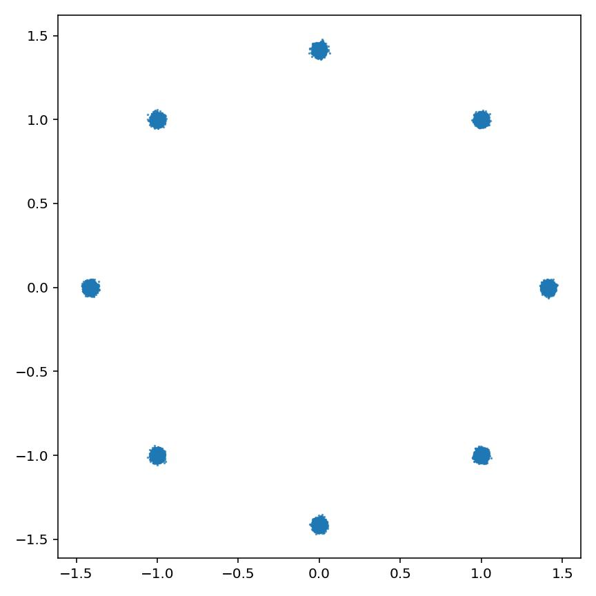
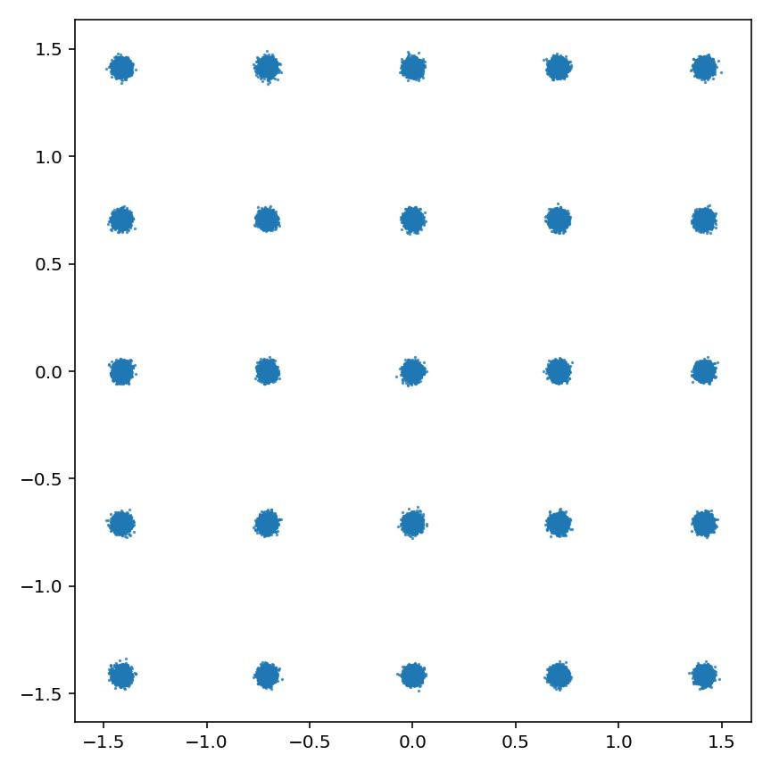
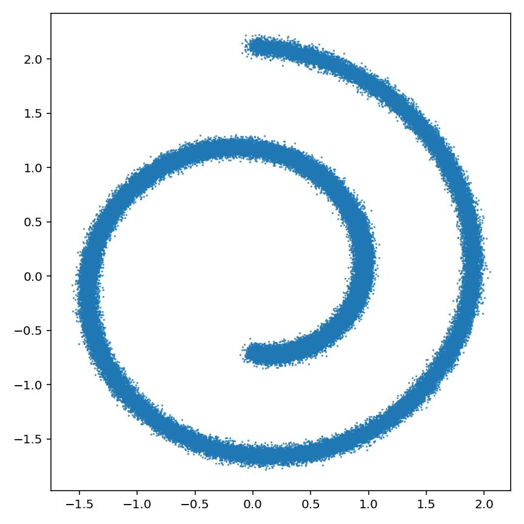
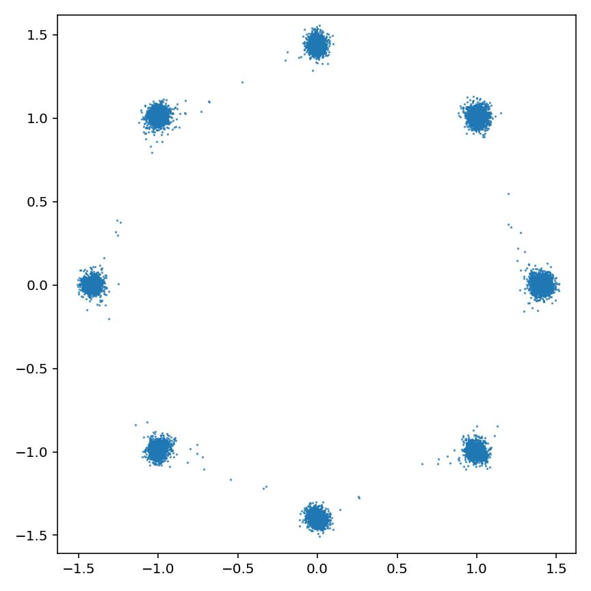
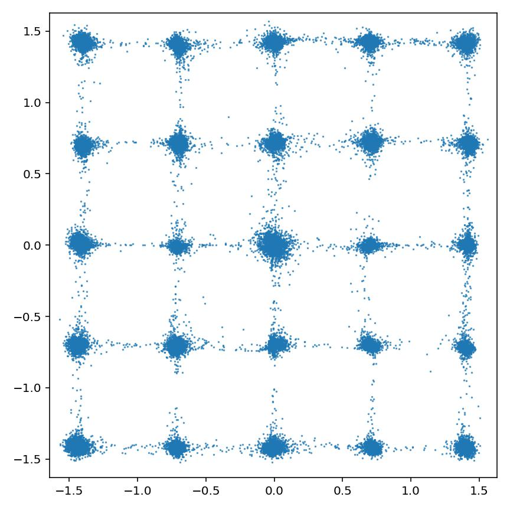
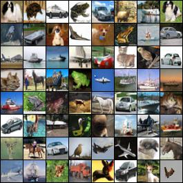
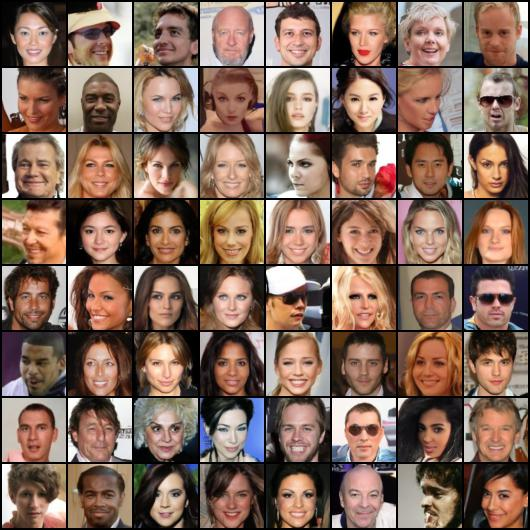

<p align="center"></p>

---

# PyTorch Implementation of Denoising Diffusion Probabilistic Models [[paper]](https://arxiv.org/abs/2006.11239) [[official repo]](https://github.com/hojonathanho/diffusion)


## Features

- [x] Original DDPM[^1] training & sampling
- [x] DDIM[^2] sampler
- [x] Standard evaluation metrics
	- [x] Fréchet Inception Distance[^3] (FID)
	- [x] Precision & Recall[^4]
- [x] Distributed Data Parallel[^5] (DDP) multi-GPU training


## Requirements

- torch >= 1.12.0
- torchvision >= 1.13.0
- scipy >= 1.7.3


## Code usage

### Toy data

<details>
<summary>Expand</summary>
<pre><code>
usage: train_toy.py [-h] [--dataset {gaussian8,gaussian25,swissroll}]
                    [--size SIZE] [--root ROOT] [--epochs EPOCHS] [--lr LR]
                    [--beta1 BETA1] [--beta2 BETA2] [--lr-warmup LR_WARMUP]
                    [--batch-size BATCH_SIZE] [--timesteps TIMESTEPS]
                    [--beta-schedule {quad,linear,warmup10,warmup50,jsd}]
                    [--beta-start BETA_START] [--beta-end BETA_END]
                    [--model-mean-type {mean,x_0,eps}]
                    [--model-var-type {learned,fixed-small,fixed-large}]
                    [--loss-type {kl,mse}] [--image-dir IMAGE_DIR]
                    [--chkpt-dir CHKPT_DIR] [--chkpt-intv CHKPT_INTV]
                    [--eval-intv EVAL_INTV] [--seed SEED] [--resume]
                    [--device DEVICE] [--mid-features MID_FEATURES]
                    [--num-temporal-layers NUM_TEMPORAL_LAYERS]
optional arguments:
  -h, --help            show this help message and exit
  --dataset {gaussian8,gaussian25,swissroll}
  --size SIZE
  --root ROOT           root directory of datasets
  --epochs EPOCHS       total number of training epochs
  --lr LR               learning rate
  --beta1 BETA1         beta_1 in Adam
  --beta2 BETA2         beta_2 in Adam
  --lr-warmup LR_WARMUP
                        number of warming-up epochs
  --batch-size BATCH_SIZE
  --timesteps TIMESTEPS
                        number of diffusion steps
  --beta-schedule {quad,linear,warmup10,warmup50,jsd}
  --beta-start BETA_START
  --beta-end BETA_END
  --model-mean-type {mean,x_0,eps}
  --model-var-type {learned,fixed-small,fixed-large}
  --loss-type {kl,mse}
  --image-dir IMAGE_DIR
  --chkpt-dir CHKPT_DIR
  --chkpt-intv CHKPT_INTV
                        frequency of saving a checkpoint
  --eval-intv EVAL_INTV
  --seed SEED           random seed
  --resume              to resume from a checkpoint
  --device DEVICE
  --mid-features MID_FEATURES
  --num-temporal-layers NUM_TEMPORAL_LAYERS
</code></pre>
</details>

### Real-world data

<details><summary>Expand</summary>
<pre><code>
usage: train.py [-h] [--dataset {mnist,cifar10,celeba}] [--root ROOT]
                [--epochs EPOCHS] [--lr LR] [--beta1 BETA1] [--beta2 BETA2]
                [--batch-size BATCH_SIZE] [--timesteps TIMESTEPS]
                [--beta-schedule {quad,linear,warmup10,warmup50,jsd}]
                [--beta-start BETA_START] [--beta-end BETA_END]
                [--model-mean-type {mean,x_0,eps}]
                [--model-var-type {learned,fixed-small,fixed-large}]
                [--loss-type {kl,mse}] [--num-workers NUM_WORKERS]
                [--train-device TRAIN_DEVICE] [--eval-device EVAL_DEVICE]
                [--image-dir IMAGE_DIR] [--num-save-images NUM_SAVE_IMAGES]
                [--config-dir CONFIG_DIR] [--chkpt-dir CHKPT_DIR]
                [--chkpt-intv CHKPT_INTV] [--seed SEED] [--resume] [--eval]
                [--use-ema] [--ema-decay EMA_DECAY] [--distributed]
optional arguments:
  -h, --help            show this help message and exit
  --dataset {mnist,cifar10,celeba}
  --root ROOT           root directory of datasets
  --epochs EPOCHS       total number of training epochs
  --lr LR               learning rate
  --beta1 BETA1         beta_1 in Adam
  --beta2 BETA2         beta_2 in Adam
  --batch-size BATCH_SIZE
  --timesteps TIMESTEPS
                        number of diffusion steps
  --beta-schedule {quad,linear,warmup10,warmup50,jsd}
  --beta-start BETA_START
  --beta-end BETA_END
  --model-mean-type {mean,x_0,eps}
  --model-var-type {learned,fixed-small,fixed-large}
  --loss-type {kl,mse}
  --num-workers NUM_WORKERS
                        number of workers for data loading
  --train-device TRAIN_DEVICE
  --eval-device EVAL_DEVICE
  --image-dir IMAGE_DIR
  --num-save-images NUM_SAVE_IMAGES
                        number of images to generate & save
  --config-dir CONFIG_DIR
  --chkpt-dir CHKPT_DIR
  --chkpt-intv CHKPT_INTV
                        frequency of saving a checkpoint
  --seed SEED           random seed
  --resume              to resume from a checkpoint
  --eval                whether to evaluate fid during training
  --use-ema             whether to use exponential moving average
  --ema-decay EMA_DECAY
                        decay factor of ema
  --distributed         whether to use distributed training
</code></pre>
</details>

### Examples
```shell
# train a 25-Gaussian toy model with single gpu for a total of 100 epochs
python train_toy.py --dataset gaussian8 --device cuda:0 --epochs 100

# train a cifar10 model with single gpu for a total of 50 epochs
python train.py --dataset cifar10 --train-device cuda:0 --epochs 50

# train a celeba model with 2 gpus and an effective batch-size of 64 x 2 = 128
export CUDA_VISIBLE_DEVICES=0,1&&torchrun --standalone --nproc_per_node 2 --rdzv_backend c10d train.py --dataset celeba --use-ema --distributed
```


## Experiment results

### Toy data

<p align="center">
	<table width="100%">
		<tr>
			<th width="10%"><b>Dataset</b></th>
			<th width="30%">8 Gaussian</th>
			<th width="30%">25 Gaussian</th>
			<th width="30%">Swiss Roll</th>
		</tr><tr>
			<td><b>True</b></td>
			<td></td>
			<td></td>
			<td></td>
		</tr><tr>
			<td><b>Generated</b></td>
			<td></td>
			<td></td>
			<td></td>
		</tr>
	</table>
</p>

<details>
	<summary>Training process (animated)</summary>
    <p>
        <table width="100%">
            <tr>
                <th width="10%"><b>Dataset</b></th>
                <th width="30%">8 Gaussian</th>
                <th width="30%">25 Gaussian</th>
                <th width="30%">Swiss Roll</th>
            </tr><tr>
                <td><b>Generated</b></td>
                <td></td>
                <td></td>
                <td></td>
            </tr>
        </table>
    </p>
</details>

### Real-world data

*Table of evaluated metrics*

<p align="center">
    <table width="100%">
        <tr>
            <th>Dataset</th>
            <th>FID (↓)</th>
            <th>Precision (↑)</th>
            <th>Recall (↑)</th>
            <th>Training steps</th>
            <th>Training loss</th>
            <th>Checkpoint</th>
        </tr><tr>
            <td>CIFAR-10</td>
            <td>9.23</td>
            <td>0.692</td>
            <td>0.473</td>
            <td>46.8k</td>
            <td>0.0302</td>
			<td>-</td>
        </tr>
        <tr>
            <td>&emsp;|__</td>
            <td>6.02</td>
            <td>0.693</td>
            <td>0.510</td>
            <td>93.6k</td>
            <td>0.0291</td>
            <td>-</td>
        </tr><tr>
            <td>&emsp;|__</td>
            <td>4.04</td>
            <td>0.701</td>
            <td>0.550</td>
            <td>234.0k</td>
            <td>0.0298</td>
            <td>-</td>
        </tr><tr>
            <td>&emsp;|__</td>
            <td>3.36</td>
            <td>0.717</td>
            <td><b>0.559</b></td>
            <td>468.0k</td>
            <td>0.0284</td>
            <td>-</td>
        </tr>
        <tr>
            <td>&emsp;|__</td>
            <td><b>3.25</b></td>
            <td><b>0.736</b></td>
            <td>0.548</td>
            <td>842.4k</td>
            <td><b>0.0277</b></td>
            <td><a href="https://github.com/tqch/ddpm-torch/releases/download/checkpoints/ddpm_cifar10_2160.pt">[Link]</a></td>
        </tr><tr>
            <td>CelebA</td>
            <td>4.81</td>
            <td><b>0.766</b></td>
            <td>0.490</td>
            <td>189.8k</td>
            <td>0.0153</td>
			<td>-</td>
        </tr>
        <tr>
            <td>&emsp;|__</td>
            <td>3.88</td>
            <td>0.760</td>
            <td>0.516</td>
            <td>379.7k</td>
            <td>0.0151</td>
			<td>-</td>
        </tr>
        <tr>
            <td>&emsp;|__</td>
            <td><b>3.07</b></td>
            <td>0.754</td>
            <td><b>0.540</b></td>
            <td>949.2k</td>
            <td><b>0.0147</b></td>
			<td><a href="https://github.com/tqch/ddpm-torch/releases/download/checkpoints/ddpm_celeba_600.pt">[Link]</a></td>
        </tr>
    </table>
</p>

<p align="center">
	<table width="100%">
            <tr>
                <th width="10%">Dataset</th>
                <th width="45%">CIFAR-10</td>
                <th width="45%">CelebA</td>
            </tr><tr>
                <td><b>Generated images</b></td>
                <td></td>
                <td></td>
            </tr>
	</table>
</p>
<details>
	<summary>Training process (animated)</summary>
    <p align="center">
        <table width="100%">
            <tr>
                <th width="10%">Dataset</th>
                <th width="45%">CIFAR-10</td>
                <th width="45%">CelebA</td>
            </tr><tr>
                <td><b>Generated images</b></td>
                <td></td>
                <td></td>
            </tr>
        </table>
    </p>
</details>

<details>
	<summary>Denoising process (animated)</summary>
    <p align="center">
        <table width="100%"">
            <tr>
                <th width="10%">Dataset</th>
                <th width="45%">CIFAR-10</td>
                <th width="45%">CelebA</td>
            </tr><tr>
                <td><b>Generated images</b></td>
                <td></td>
                <td></td>
            </tr>
        </table>
    </p>
</details>

## Related repositories
- Simple Web App empowered by Streamlit: [[tqch/diffusion-webapp]](https://github.com/tqch/diffusion-webapp)
- Classifier-Free Guidance: [[tqch/v-diffusion-torch]](https://github.com/tqch/v-diffusion-torch)


## References

[^1]: Ho, Jonathan, Ajay Jain, and Pieter Abbeel. "Denoising diffusion probabilistic models." Advances in Neural Information Processing Systems 33 (2020): 6840-6851.
[^2]: Song, Jiaming, Chenlin Meng, and Stefano Ermon. "Denoising Diffusion Implicit Models." International Conference on Learning Representations. 2020.
[^3]: Heusel, Martin, et al. "Gans trained by a two time-scale update rule converge to a local nash equilibrium." Advances in neural information processing systems 30 (2017).
[^4]: Kynkäänniemi, Tuomas, et al. "Improved precision and recall metric for assessing generative models." Advances in Neural Information Processing Systems 32 (2019).
[^5]: DistributedDataParallel - PyTorch 1.12 Documentation, https://pytorch.org/docs/stable/generated/torch.nn.parallel.DistributedDataParallel.html.
