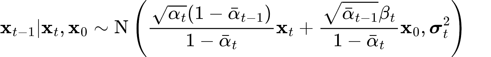
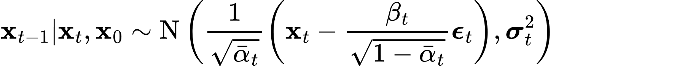
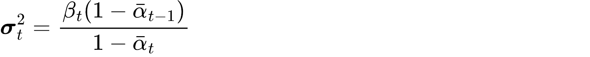

# PyTorch Implementation of Denoising Diffusion Probabilistic Models [[paper]](https://arxiv.org/abs/2006.11239) [[official repo]](https://github.com/hojonathanho/diffusion)

## Reference formula

### Posterior mean and variance

Or

where

## Celeb-A Example

### Samples over training (50 epochs)

### Predictions along the reverse sample path

